<!---

This file is used to generate your project datasheet. Please fill in the information below and delete any unused
sections.

You can also include images in this folder and reference them in the markdown. Each image must be less than
512 kb in size, and the combined size of all images must be less than 1 MB.
-->

```mermaid
graph TB
    %% Input Bits and Partial Products by Rows (Q0, Q1, Q2, Q3)
    A3["A3"]
    A2["A2"]
    A1["A1"]
    A0["A0"]

    B3["B3"]
    B2["B2"]
    B1["B1"]
    B0["B0"]

    %% Row Q0 (A * B0)
    A3 --> |"AND with B0"| Q0_3["Q0_3 (A3 * B0)"]
    A2 --> |"AND with B0"| Q0_2["Q0_2 (A2 * B0)"]
    A1 --> |"AND with B0"| Q0_1["Q0_1 (A1 * B0)"]
    A0 --> |"AND with B0"| Q0_0["Q0_0 (A0 * B0)"]

    %% Row Q1 (A * B1)
    A3 --> |"AND with B1"| Q1_3["Q1_3 (A3 * B1)"]
    A2 --> |"AND with B1"| Q1_2["Q1_2 (A2 * B1)"]
    A1 --> |"AND with B1"| Q1_1["Q1_1 (A1 * B1)"]
    A0 --> |"AND with B1"| Q1_0["Q1_0 (A0 * B1)"]

    %% Row Q2 (A * B2)
    A3 --> |"AND with B2"| Q2_3["Q2_3 (A3 * B2)"]
    A2 --> |"AND with B2"| Q2_2["Q2_2 (A2 * B2)"]
    A1 --> |"AND with B2"| Q2_1["Q2_1 (A1 * B2)"]
    A0 --> |"AND with B2"| Q2_0["Q2_0 (A0 * B2)"]

    %% Row Q3 (A * B3)
    A3 --> |"AND with B3"| Q3_3["Q3_3 (A3 * B3)"]
    A2 --> |"AND with B3"| Q3_2["Q3_2 (A2 * B3)"]
    A1 --> |"AND with B3"| Q3_1["Q3_1 (A1 * B3)"]
    A0 --> |"AND with B3"| Q3_0["Q3_0 (A0 * B3)"]

    %% Full Adders to Sum Partial Products
    Q0_0 --> P0["P0"]
    Q0_1 --> FA1["Full Adder 1"]
    Q1_0 --> FA1
    FA1 --> P1["P1"]

    Q0_2 --> FA2["Full Adder 2"]
    Q1_1 --> FA2
    Q2_0 --> FA2
    FA2 --> P2["P2"]

    Q0_3 --> FA3["Full Adder 3"]
    Q1_2 --> FA3
    Q2_1 --> FA3
    Q3_0 --> FA3
    FA3 --> P3["P3"]

    Q1_3 --> FA4["Full Adder 4"]
    Q2_2 --> FA4
    Q3_1 --> FA4
    FA4 --> P4["P4"]

    Q2_3 --> FA5["Full Adder 5"]
    Q3_2 --> FA5
    FA5 --> P5["P5"]

    Q3_3 --> FA6["Full Adder 6"]
    FA6 --> P6["P6"]

    FA6 --> P7["P7 (Most Significant Bit)"]


```

## How it works

Explain how your project works

## How to test

Explain how to use your project

## External hardware
N/A

List external hardware used in your project (e.g. PMOD, LED display, etc), if any
