<!---

This file is used to generate your project datasheet. Please fill in the information below and delete any unused
sections.

You can also include images in this folder and reference them in the markdown. Each image must be less than
512 kb in size, and the combined size of all images must be less than 1 MB.
-->

```mermaid
graph TD
    %% Input Bits for Clarity
    A3["A3 (Most Significant Bit of A)"]
    A2["A2 (Second Bit of A)"]
    A1["A1 (Third Bit of A)"]
    A0["A0 (Least Significant Bit of A)"]

    B3["B3 (Most Significant Bit of B)"]
    B2["B2 (Second Bit of B)"]
    B1["B1 (Third Bit of B)"]
    B0["B0 (Least Significant Bit of B)"]

    %% Row Q0 (Partial Products of A * B0)
    A3 --> |"AND with B0"| Q0_3["Q0_3 = A3 * B0"]
    A2 --> |"AND with B0"| Q0_2["Q0_2 = A2 * B0"]
    A1 --> |"AND with B0"| Q0_1["Q0_1 = A1 * B0"]
    A0 --> |"AND with B0"| Q0_0["Q0_0 = A0 * B0"]

    %% Row Q1 (Partial Products of A * B1)
    A3 --> |"AND with B1"| Q1_3["Q1_3 = A3 * B1"]
    A2 --> |"AND with B1"| Q1_2["Q1_2 = A2 * B1"]
    A1 --> |"AND with B1"| Q1_1["Q1_1 = A1 * B1"]
    A0 --> |"AND with B1"| Q1_0["Q1_0 = A0 * B1"]

    %% Row Q2 (Partial Products of A * B2)
    A3 --> |"AND with B2"| Q2_3["Q2_3 = A3 * B2"]
    A2 --> |"AND with B2"| Q2_2["Q2_2 = A2 * B2"]
    A1 --> |"AND with B2"| Q2_1["Q2_1 = A1 * B2"]
    A0 --> |"AND with B2"| Q2_0["Q2_0 = A0 * B2"]

    %% Row Q3 (Partial Products of A * B3)
    A3 --> |"AND with B3"| Q3_3["Q3_3 = A3 * B3"]
    A2 --> |"AND with B3"| Q3_2["Q3_2 = A2 * B3"]
    A1 --> |"AND with B3"| Q3_1["Q3_1 = A1 * B3"]
    A0 --> |"AND with B3"| Q3_0["Q3_0 = A0 * B3"]

    %% Add spacing between rows for visibility
    Q0_0 --- Q0_1
    Q0_1 --- Q0_2
    Q0_2 --- Q0_3

    Q1_0 --- Q1_1
    Q1_1 --- Q1_2
    Q1_2 --- Q1_3

    Q2_0 --- Q2_1
    Q2_1 --- Q2_2
    Q2_2 --- Q2_3

    Q3_0 --- Q3_1
    Q3_1 --- Q3_2
    Q3_2 --- Q3_3

    %% Sum Stages with Full Adders and Final Outputs
    %% Full Adder Stage 1 (P0)
    Q0_0 --> P0["P0 (Least Significant Bit of Product)"]

    %% Full Adder Stage 2 (P1)
    Q0_1 --> FA1["Full Adder for P1"]:::fa
    Q1_0 --> FA1
    FA1 --> P1["P1 (Second Bit of Product)"]

    %% Full Adder Stage 3 (P2)
    Q0_2 --> FA2["Full Adder for P2"]:::fa
    Q1_1 --> FA2
    Q2_0 --> FA2
    FA2 --> P2["P2 (Third Bit of Product)"]

    %% Full Adder Stage 4 (P3)
    Q0_3 --> FA3["Full Adder for P3"]:::fa
    Q1_2 --> FA3
    Q2_1 --> FA3
    Q3_0 --> FA3
    FA3 --> P3["P3 (Fourth Bit of Product)"]

    %% Full Adder Stage 5 (P4)
    Q1_3 --> FA4["Full Adder for P4"]:::fa
    Q2_2 --> FA4
    Q3_1 --> FA4
    FA4 --> P4["P4 (Fifth Bit of Product)"]

    %% Full Adder Stage 6 (P5)
    Q2_3 --> FA5["Full Adder for P5"]:::fa
    Q3_2 --> FA5
    FA5 --> P5["P5 (Sixth Bit of Product)"]

    %% Full Adder Stage 7 (P6 and Carry to P7)
    Q3_3 --> FA6["Full Adder for P6"]:::fa
    FA6 --> P6["P6 (Seventh Bit of Product)"]

    FA6 --> P7["P7 (Most Significant Bit of Product)"]

    %% Style Definitions
    classDef fa fill:#cce5ff, stroke:#004085, stroke-width:2px, color:#000000;
    classDef input fill:#d4edda, stroke:#155724, stroke-width:2px, color:#000000;
    classDef product fill:#fff3cd, stroke:#856404, stroke-width:2px, color:#000000;
    classDef output fill:#f8d7da, stroke:#721c24, stroke-width:2px, color:#000000;

    %% Apply styles to nodes
    class A3,A2,A1,A0 input;
    class B3,B2,B1,B0 input;
    class Q0_0,Q0_1,Q0_2,Q0_3,Q1_0,Q1_1,Q1_2,Q1_3,Q2_0,Q2_1,Q2_2,Q2_3,Q3_0,Q3_1,Q3_2,Q3_3 product;
    class FA1,FA2,FA3,FA4,FA5,FA6 fa;
    class P0,P1,P2,P3,P4,P5,P6,P7 output;
```





```mermaid
graph TD
    A[Input A (a3, a2, a1, a0)] 
    B[Input B (b3, b2, b1, b0)]
    
    A -->|AND| P0[Partial Product P0]
    A -->|AND| P1[Partial Product P1]
    A -->|AND| P2[Partial Product P2]
    A -->|AND| P3[Partial Product P3]
    
    B -->|b0| P0
    B -->|b1| P1
    B -->|b2| P2
    B -->|b3| P3
    
    P0 -->|Shift 0| S1[Intermediate Sum]
    P1 -->|Shift 1| S1
    P2 -->|Shift 2| S2[Next Sum]
    P3 -->|Shift 3| S2
    
    S1 --> Final[Final Result]
    S2 --> Final


```


## How it works

Explain how your project works

## How to test

Explain how to use your project

## External hardware
N/A

List external hardware used in your project (e.g. PMOD, LED display, etc), if any
