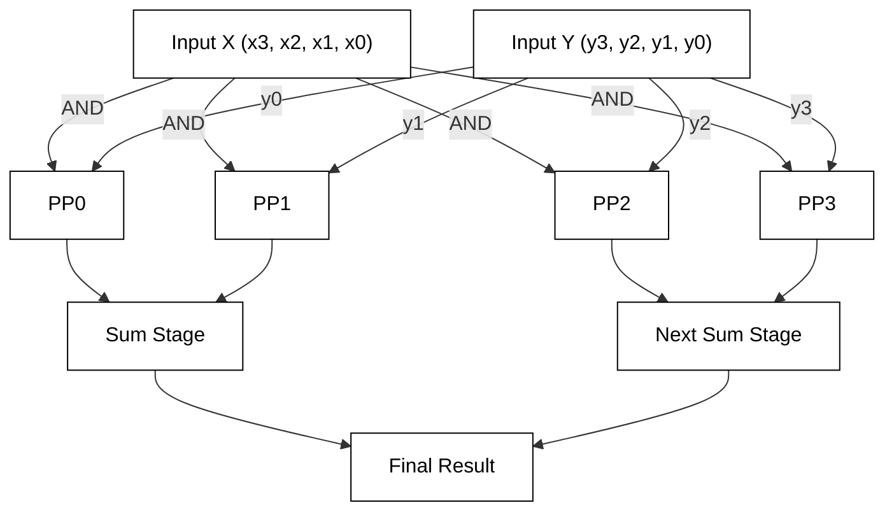

```mermaid
flowchart TD
    %% Input Bits for Clarity
    X3["X3 (Most Significant Bit of X)"]:::input
    X2["X2 (Second Bit of X)"]:::input
    X1["X1 (Third Bit of X)"]:::input
    X0["X0 (Least Significant Bit of X)"]:::input

    Y3["Y3 (Most Significant Bit of Y)"]:::input
    Y2["Y2 (Second Bit of Y)"]:::input
    Y1["Y1 (Third Bit of Y)"]:::input
    Y0["Y0 (Least Significant Bit of Y)"]:::input

    %% Row Q0 (Partial Products of X * Y0)
    X3 --> |"AND with Y0"| Q0_3["Q0_3 = X3 * Y0"]:::product
    X2 --> |"AND with Y0"| Q0_2["Q0_2 = X2 * Y0"]:::product
    X1 --> |"AND with Y0"| Q0_1["Q0_1 = X1 * Y0"]:::product
    X0 --> |"AND with Y0"| Q0_0["Q0_0 = X0 * Y0"]:::product

    %% Row Q1 (Partial Products of X * Y1)
    X3 --> |"AND with Y1"| Q1_3["Q1_3 = X3 * Y1"]:::product
    X2 --> |"AND with Y1"| Q1_2["Q1_2 = X2 * Y1"]:::product
    X1 --> |"AND with Y1"| Q1_1["Q1_1 = X1 * Y1"]:::product
    X0 --> |"AND with Y1"| Q1_0["Q1_0 = X0 * Y1"]:::product

    %% Row Q2 (Partial Products of X * Y2)
    X3 --> |"AND with Y2"| Q2_3["Q2_3 = X3 * Y2"]:::product
    X2 --> |"AND with Y2"| Q2_2["Q2_2 = X2 * Y2"]:::product
    X1 --> |"AND with Y2"| Q2_1["Q2_1 = X1 * Y2"]:::product
    X0 --> |"AND with Y2"| Q2_0["Q2_0 = X0 * Y2"]:::product

    %% Row Q3 (Partial Products of X * Y3)
    X3 --> |"AND with Y3"| Q3_3["Q3_3 = X3 * Y3"]:::product
    X2 --> |"AND with Y3"| Q3_2["Q3_2 = X2 * Y3"]:::product
    X1 --> |"AND with Y3"| Q3_1["Q3_1 = X1 * Y3"]:::product
    X0 --> |"AND with Y3"| Q3_0["Q3_0 = X0 * Y3"]:::product

    %% Add spacing between rows for visibility
    Q0_0 --- Q0_1
    Q0_1 --- Q0_2
    Q0_2 --- Q0_3

    Q1_0 --- Q1_1
    Q1_1 --- Q1_2
    Q1_2 --- Q1_3

    Q2_0 --- Q2_1
    Q2_1 --- Q2_2
    Q2_2 --- Q2_3

    Q3_0 --- Q3_1
    Q3_1 --- Q3_2
    Q3_2 --- Q3_3

    %% Sum Stages with Full Adders and Final Outputs
    %% Full Adder Stage 1 (P0)
    Q0_0 --> P0["P0 (Least Significant Bit of Product)"]:::output

    %% Full Adder Stage 2 (P1)
    Q0_1 --> FA1["Full Adder for P1"]:::fa
    Q1_0 --> FA1
    FA1 --> P1["P1 (Second Bit of Product)"]:::output

    %% Full Adder Stage 3 (P2)
    Q0_2 --> FA2["Full Adder for P2"]:::fa
    Q1_1 --> FA2
    Q2_0 --> FA2
    FA2 --> P2["P2 (Third Bit of Product)"]:::output

    %% Full Adder Stage 4 (P3)
    Q0_3 --> FA3["Full Adder for P3"]:::fa
    Q1_2 --> FA3
    Q2_1 --> FA3
    Q3_0 --> FA3
    FA3 --> P3["P3 (Fourth Bit of Product)"]:::output

    %% Full Adder Stage 5 (P4)
    Q1_3 --> FA4["Full Adder for P4"]:::fa
    Q2_2 --> FA4
    Q3_1 --> FA4
    FA4 --> P4["P4 (Fifth Bit of Product)"]:::output

    %% Full Adder Stage 6 (P5)
    Q2_3 --> FA5["Full Adder for P5"]:::fa
    Q3_2 --> FA5
    FA5 --> P5["P5 (Sixth Bit of Product)"]:::output

    %% Full Adder Stage 7 (P6 and Carry to P7)
    Q3_3 --> FA6["Full Adder for P6"]:::fa
    FA6 --> P6["P6 (Seventh Bit of Product)"]:::output

    FA6 --> P7["P7 (Most Significant Bit of Product)"]:::output

    %% Style Definitions
    classDef fa fill:#cce5ff,stroke:#004085,stroke-width:2px,color:#000000
    classDef input fill:#d4edda,stroke:#155724,stroke-width:2px,color:#000000
    classDef product fill:#fff3cd,stroke:#856404,stroke-width:2px,color:#000000
    classDef output fill:#f8d7da,stroke:#721c24,stroke-width:2px,color:#000000

    %% Apply styles to nodes
    class X3,X2,X1,X0,Y3,Y2,Y1,Y0 input
    class Q0_0,Q0_1,Q0_2,Q0_3,Q1_0,Q1_1,Q1_2,Q1_3,Q2_0,Q2_1,Q2_2,Q2_3,Q3_0,Q3_1,Q3_2,Q3_3 product
    class FA1,FA2,FA3,FA4,FA5,FA6 fa
    class P0,P1,P2,P3,P4,P5,P6,P7 output



```

```mermaid
flowchart TD
    %% Input Bits for Clarity
    X3["X3 (Most Significant Bit of X)"]:::input
    X2["X2 (Second Bit of X)"]:::input
    X1["X1 (Third Bit of X)"]:::input
    X0["X0 (Least Significant Bit of X)"]:::input

    Y3["Y3 (Most Significant Bit of Y)"]:::input
    Y2["Y2 (Second Bit of Y)"]:::input
    Y1["Y1 (Third Bit of Y)"]:::input
    Y0["Y0 (Least Significant Bit of Y)"]:::input

    %% Partial Products for X * Y
    X3 --> |"AND with Y0"| PP0["Partial Product 0: X3 AND Y0"]:::product
    X2 --> |"AND with Y1"| PP1["Partial Product 1: X2 AND Y1"]:::product
    X1 --> |"AND with Y2"| PP2["Partial Product 2: X1 AND Y2"]:::product
    X0 --> |"AND with Y3"| PP3["Partial Product 3: X0 AND Y3"]:::product

    Y3 --> |"AND with X0"| Q0["Partial Product 4: Y3 AND X0"]:::product
    Y2 --> |"AND with X1"| Q1["Partial Product 5: Y2 AND X1"]:::product
    Y1 --> |"AND with X2"| Q2["Partial Product 6: Y1 AND X2"]:::product
    Y0 --> |"AND with X3"| Q3["Partial Product 7: Y0 AND X3"]:::product

    %% Sum Stages with Full Adders and Final Outputs
    %% Full Adder stage 1 (P0)
    PP0 --> FullAdder0["Sum with Carry In: Partial Product 0"]:::fa
    Q0 --> FullAdder0
    FullAdder0 --> P0["P0 (Least Significant Bit of Product)"]:::output

    %% Full Adder Stage 2 (P1)
    PP1 --> FullAdder1["Sum with Carry In: Partial Product 1"]:::fa
    Q1 --> FullAdder1
    FullAdder1 --> P1["P1 (Second Bit of Product)"]:::output

    %% Full Adder Stage 3 (P2)
    PP2 --> FullAdder2["Sum with Carry In: Partial Product 2"]:::fa
    Q2 --> FullAdder2
    FullAdder2 --> P2["P2 (Third Bit of Product)"]:::output

    %% Full Adder Stage 4 (P3)
    PP3 --> FullAdder3["Sum with Carry In: Partial Product 3"]:::fa
    Q3 --> FullAdder3
    FullAdder3 --> P3["P3 (Fourth Bit of Product)"]:::output

    %% Style Definitions
    classDef fa fill:#cce5ff,stroke:#004085,stroke-width:2px,color:#000000
    classDef input fill:#d4edda,stroke:#155724,stroke-width:2px,color:#000000
    classDef product fill:#fff3cd,stroke:#856404,stroke-width:2px,color:#000000
    classDef output fill:#f8d7da,stroke:#721c24,stroke-width:2px,color:#000000

    %% Apply styles to nodes
    class X3,X2,X1,X0,Y3,Y2,Y1,Y0 input
    class PP0,PP1,PP2,PP3,Q0,Q1,Q2,Q3 product
    class FullAdder0,FullAdder1,FullAdder2,FullAdder3 fa
    class P0,P1,P2,P3 output
```m
